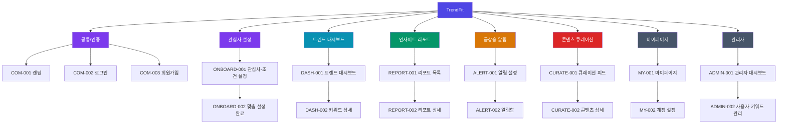

# TrendFit 정보구조도 (IA)

## 메타
| 항목 | 내용 |
|------|------|
| 서비스명 | TrendFit (나에게 맞는 트렌드 및 관심사 인사이트 서비스) |
| 플랫폼 | 웹 (Streamlit/Dash 기반 반응형 웹) |
| 대상 사용자 | 마케팅·콘텐츠 제작·소비 등 목적으로 관심 분야의 최신 트렌드와 급상승 키워드를 파악하려는 일반 사용자 |
| 작성일 | 2026-08-08 |
| 문서 버전 | v1.1 |

> **v1.1 변경 이력(2026-08-12)**: ONBOARD-001의 관심 분야 예시를 네이버 주제 필터 기준 20개
> 확정 목록으로 갱신. 상세는 [srs.md](srs.md) v1.1 변경 이력 참고.

## 화면 목록

| 화면ID | 화면명 | Depth | 상위화면 | 주요 콘텐츠 | 주요 기능 | 데이터 소스 | 접근권한 |
|--------|--------|-------|----------|-------------|-----------|-------------|----------|
| COM-001 | 랜딩 | 1 | Root | 서비스 소개, 핵심 가치 문구, 대표 트렌드 미리보기 | 시작하기, 로그인 이동 | Static | G |
| COM-002 | 로그인 | 1 | COM-001 | 이메일/비밀번호 입력폼, 소셜 로그인 버튼 | 로그인, 회원가입 이동, 비밀번호 찾기 | API | G |
| COM-003 | 회원가입 | 1 | COM-002 | 가입 폼, 약관 동의 | 이메일 인증, 가입 완료 | API | G |
| ONBOARD-001 | 관심사·조건 설정 | 1 | COM-003 | 관심 분야(여행/패션/뷰티/푸드/IT테크 등 20개), 목적, 연령대·성별, 선호 플랫폼, 탐색 기간 | 관심 분야 선택, 목적 선택, 프로필 입력, 조건 저장 | API | U |
| ONBOARD-002 | 맞춤 설정 완료 | 2 | ONBOARD-001 | 선택 조건 요약, 추천 키워드 미리보기 | 설정 확인, 대시보드 이동 | API | U |
| DASH-001 | 트렌드 대시보드(홈) | 1 | Root(TAB1) | 분야별 핫 키워드 목록, 언급량 그래프, Spike Score 랭킹 | 분야 필터, 기간 필터(24시간/1주/1개월), 키워드 상세 이동 | API | G/U |
| DASH-002 | 키워드 상세 | 2 | DASH-001 | 검색량 추이 그래프, 긍·부정 감성 비율, 연관 키워드, 연령·성별 관심도 가중치 | 기간 변경, 급상승 알림 등록, 관련 콘텐츠 이동 | API | U |
| REPORT-001 | 인사이트 리포트 목록 | 1 | Root(TAB2) | 조건별 리포트 카드(생성일, 분야, 요약) | 리포트 생성 요청, 리포트 필터 | API | U |
| REPORT-002 | 리포트 상세 | 2 | REPORT-001 | 최신 이슈 요약, Word Cloud, 키워드 연관성 Network Graph | 리포트 저장, 공유, PDF 다운로드 | API | U |
| ALERT-001 | 급상승 알림 설정 | 1 | Root(TAB3) | 등록된 관심 키워드 목록, Spike 임계치 설정 | 키워드 등록/삭제, 수신 방식 설정(이메일/인앱) | API | U |
| ALERT-002 | 알림함 | 2 | ALERT-001 | 알림 히스토리(키워드, 폭증 지수, 시각) | 알림 읽음 처리, 알림 상세(키워드 상세) 이동 | API/Local | U |
| CURATE-001 | 콘텐츠 큐레이션 피드 | 1 | Root(TAB4) | 인기 게시물·뉴스 카드(썸네일, 제목, 출처 플랫폼) | 플랫폼 필터, 무한 스크롤 | API | U |
| CURATE-002 | 콘텐츠 상세 | 2 | CURATE-001 | 콘텐츠 미리보기, 원문 링크, 연관 키워드 태그 | 원문 이동, 스크랩 | API | U |
| MY-001 | 마이페이지 | 1 | Root(TAB5) | 프로필 정보, 등록 관심 키워드, 스크랩 목록 | 관심 분야 수정, 스크랩 관리, 설정 이동 | API | U |
| MY-002 | 계정 설정 | 2 | MY-001 | 계정 정보, 알림 수신 설정, 기본 탐색 기간 | 정보 수정, 비밀번호 변경, 회원 탈퇴 | API | U |
| ADMIN-001 | 관리자 대시보드 | 1 | Root(Admin) | 데이터 수집 현황(API 호출량, 오류율), 사용자·키워드 통계 | 데이터 소스 상태 모니터링, 배치 작업 확인 | API | A |
| ADMIN-002 | 사용자·키워드 관리 | 2 | ADMIN-001 | 사용자 목록, 등록 키워드 통계, 신고 내역 | 사용자 정지, 키워드 블랙리스트 관리 | API | A |

## 계층 다이어그램

